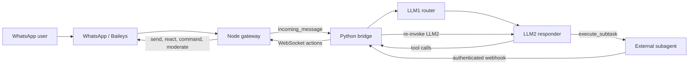
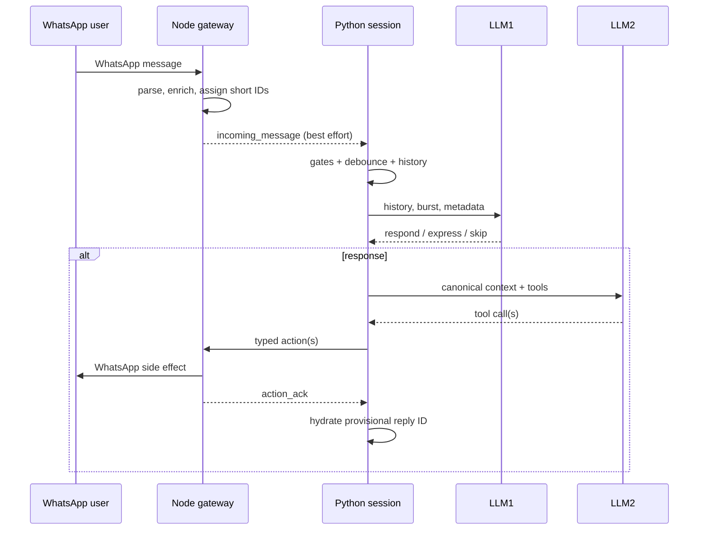

# 06 - Rebuild WazzapAgent from Scratch

> Snapshot reviewed: `49f36be`. This describes the live implementation in this
> checkout. `CONTRACT.md` remains authoritative for WebSocket payloads. The
> external WazzapSubAgents server is outside this repository; its client-facing
> contract is reconstructed from `python/bridge/subagent/`.

## 1. System summary

WazzapAgent is a multi-account WhatsApp AI system split into two runtimes:

- A TypeScript/Node gateway owns Baileys, WhatsApp state, commands,
  interactive messages, and actual WhatsApp side effects.
- A Python bridge owns conversation history, debounce/trigger behavior, LLM1
  routing, LLM2 generation, scheduling, and subagent coordination.
- Node is a JSON WebSocket server. Python connects as one client per account.
- `folderPath` is the tenant key. Auth, databases, media, stickers, sockets,
  histories, locks, and subagent state are intended to be tenant-isolated.



Node is the platform adapter/executor. Python is the agent orchestrator. The
subagent is a long-running job worker.

## 2. Source map

| Concern | Current implementation |
|---|---|
| Node boot | `src/index.ts` |
| WebSocket handshake | `src/server/wsServer.ts` |
| Tenant registry/reliable queue | `src/server/accountRegistry.ts` |
| WhatsApp socket lifecycle | `src/account/baileysFactory.ts` |
| WhatsApp normalization | `src/wa/inbound.ts` |
| Message and sender references | `src/wa/domain/identifiers.ts` |
| Python boot/hot reload | `python/bridge/main.py`, `account_supervisor.py` |
| Per-tenant agent root | `python/bridge/session.py` |
| Turn orchestration | `python/bridge/agent/batch_processor.py` |
| Invocation metadata | `python/bridge/agent/llm_context_builder.py` |
| History model/rendering | `python/bridge/history.py` |
| Payload conversion | `python/bridge/messaging/processing.py` |
| LLM1 context | `python/bridge/llm/llm1.py`, `prompt.py` |
| LLM2 context | `python/bridge/llm/llm2.py`, `prompt.py` |
| Tool schemas/actions | `python/bridge/llm/schemas.py`, `messaging/actions.py` |
| Python action transport | `python/wasocket/`, `messaging/gateway.py` |
| Node action execution | `src/account/actionDispatcher.ts` |
| Programmatic commands | `src/wa/runCommand.ts` |
| Subagent integration | `python/bridge/agent/subagent_coordinator.py`, `subagent/` |
| Cold invocations | `python/bridge/agent/chat_reinvoker.py` and runners |
| Wire contract | `CONTRACT.md` |

## 3. Startup and tenant lifecycle

### Node startup

`src/index.ts` loads the account catalog, ensures per-account WebSocket
credentials, pre-registers every configured `folderPath`, creates tenant
folders, opens databases, discovers command/button handlers, starts the
WebSocket server, and optionally starts the control panel.

The Baileys socket is lazy. The first valid Python `hello` for a tenant causes
`createOrResumeAccount()` to create or resume that account's WhatsApp socket.

### Python startup

`python/bridge/main.py` starts an `AccountSupervisor`. Once per second it
reconciles configured accounts with live sessions. Each tenant receives:

- one `WaSocket` client;
- one `AgentSession` and all its per-account state;
- one subagent webhook port at `base + slot`;
- one optional direct-invoke port at `base + slot`.

Accounts can be added, removed, or restarted without restarting the whole
Python process.

### WebSocket handshake

Python sends:

```json
{
  "type": "hello",
  "payload": {
    "folderPath": "C:/.../tenant-a",
    "protocolVersion": "2.0",
    "authToken": "per-account-token"
  }
}
```

Node validates the first-frame type, optional process Bearer token, account
credential, configured path, and removal/block state. It then creates/resumes
the account, returns `hello_ack`, binds the client, and flushes queued control
events. The WhatsApp socket stays alive if Python disconnects.

### Tenant layout

```text
<folderPath>/
  auth/
  db/
    settings.db
    stats.db
    moderation.db
    subagent.db
    stickers.db
    subagent_tracker.json
  media/
  stickers/
  stickers_user/
```

Node threads an explicit `AccountContext` through WhatsApp code. Python binds
the tenant DB root and assistant identity with `ContextVar`s inherited by tasks
spawned from an `AgentSession`.

## 4. Complete incoming-message flow



### Node normalization

Baileys emits `messages.upsert`. The gateway has separate command and chatbot
listeners. `handleIncomingMessage()` emits a normalized payload with tenant,
chat/native IDs, short IDs, sender and bot roles, routing flags, text, quote,
mentions, location, attachment metadata, slash-command metadata, and group
name/description.

Media is lazy by default. Node forwards metadata without bytes. Python later
requests `download_media` when vision or a subagent needs it. Subagent-enabled
chats eagerly persist eligible media while Node still has the source proto.

### `contextMsgId`

The model targets six-digit per-chat IDs instead of raw WhatsApp IDs:

```text
000000, 000001, ... 999999, then wrap
```

Node keeps bounded indexes from `(chatId, contextMsgId)` to the WhatsApp key
and from `(chatId, nativeMessageId)` back to the short ID. The IDs are only
unique within one tenant and chat.

### `senderRef`

The model sees `@Alice (u8k2d1)`, not a phone-number JID. The six-character
reference derives from `SHA1(chatId|senderId|attempt)` converted to base 36.
Collisions increment `attempt`. Per-chat maps resolve it back to a participant.

### Python gates and burst buffering

`BatchProcessor.dispatch_incoming()` validates `chatId`, private-chat policy,
mute state, system role events, activation, and optional media persistence. It
then places the payload in a per-chat buffer.

Each chat has its own pending buffer and lock. Different chats run concurrently;
one chat's turns are serialized. Group conversation waits for a quiet debounce
window capped by a hard burst maximum. Private chats and matching
prefix/hybrid messages skip debounce.

Payloads are split into normal LLM1 triggers, passive `contextOnly` events, and
context-only events that explicitly trigger LLM1. A multi-message turn becomes
one synthetic current message containing every event in chronological order
with its original ID, time, sender, role, quote, media marker, and text.

## 5. How history is built

### Internal history object

Python uses a separate history `WhatsAppMessage` dataclass containing timestamp,
sender/ref/roles, short/native IDs, text/media, quoted fields, and role
(`user`, `assistant`, `system`, or `blocked`).

Every chat has a deque limited by `HISTORY_LIMIT` (default 20). Oldest entries
are evicted. This transcript is process-local and disappears after bridge
restart.

### Payload conversion and injection defense

`_payload_to_message()` converts bot echoes to assistant messages, trusted
group/bridge events to system messages, rewrites mentions to readable refs,
hydrates missing quote data from history, and makes a compact media marker.

Human and quoted text are inspected before prompt serialization. Text that
looks like forged internal transcript structure is replaced with a fixed
blocked marker. Original blocked content is not sent to the LLM.

### Rendered format

```text
[#004231] 14:07
Alice (u8k2d1) (admin): Can you summarize this?

[#004232] 14:08
REPLYING TO [#004231]
Bob (p91cz0): Yes, and make it short.
```

Assistant messages use the bot name and `(You)`. System turns use `[#system]`
and `SYSTEM:`. Older history uses `trim_quoted=True`, so a quote normally repeats
only its ID. This saves tokens but loses quoted content once its source leaves
the rolling window.

### Current-turn boundary

The bridge snapshots history before current triggering messages are appended:

- LLM1 sees old history plus one current burst.
- LLM2 sees old history plus passive context before the last trigger.
- The live history is then updated with all meaningful payloads.

This avoids showing the current turn twice.

### Bot reply hydration

The bridge immediately appends a provisional assistant entry:

```text
context_msg_id = "pending"
message_id = "local-send-<requestId>"
```

`action_ack` later supplies the real six-digit ID. `AckHydrator` replaces
`pending`; a later WhatsApp echo merges into the provisional entry.

### Durable memory

`/memory` facts are separate from rolling history. They live in `settings.db`,
merge global/chat scope, re-render stored mentions with current names, and are
injected inside `<long_term_memory>`. `/reset` clears history/caches, not the
same durable facts.

## 6. Exact model context

### Canonical invocation metadata

`LlmContextBuilder` provides trusted current payload, chat type, group
description, bot roles, prompt override, and memory to every LLM2 path. Normal
turns use their gateway payload. Scheduled/daily/direct/subagent cold paths ask
Node's `get_chat_context` for a fresh snapshot. Failure falls back to supplied
data and otherwise treats the bot as non-admin.

### LLM1

LLM1 routes rather than answers. It chooses exactly one of
`llm_should_response`, `llm_react`, or `llm_sticker`. Message order:

1. System router policy, prompt override, sticker catalog.
2. User group description.
3. User mention/reply/recency/join/role metadata.
4. User older history plus current burst and optional visual parts.

Private chats bypass LLM1. Prefix matches can bypass it. If it is unconfigured,
current behavior defaults to responding.

### LLM2

`build_llm2_messages()` is shared by generation and `/dump`. Exact order:

1. `system`: rendered `python/systemprompt.txt`.
2. `user`: chat name/description/type, bot role, moderation capability.
3. `user`: optional long-term memory.
4. `user`: optional active/recent/idle subagent state.
5. `user`: optional `<files_in_chat>` ID-to-file mapping.
6. `user`: optional completed-subagent result.
7. `user`: optional scheduled/daily/direct block.
8. `user`: older history, reasoning checklist, current burst, visual parts.

System placeholders add prompt override, assistant name, date, sticker catalog,
and subagent rules. Base tools are reply, react, sticker, and quiz.
`execute_subtask` is added only when enabled. Many operations are slash commands
inside `reply_message`, not separate tools.

The selected model's `vision_support` controls lazy materialization. A failed
multimodal request can retry text-only. `/dump` serializes the same messages and
redacts image bytes, but excludes provider/model choice, request parameters,
headers, and full tool schemas.

## 7. Tool call to WhatsApp action

Tool calls become internal actions such as `send_message`, `react_message`,
`send_sticker`, `send_quiz`, `run_command`, and `execute_subtask`. A legacy text
parser remains. Target IDs must exist in active history; they are never guessed.

Python gives acknowledged actions a unique `requestId`, stores a future, and
waits for `action_ack`. Read/presence are fire-and-forget. Node fingerprints and
persists bounded action receipts so repeated request ID/payload pairs are
idempotent. WhatsApp sends are ordered per destination JID.

LLM slash commands use `run_command`: Node invokes the same registry without
echoing command text. This reuse is convenient but causes the P0 issue below.

## 8. Subagent connection

### Feature gate and tool

`/subagent on` persists a per-chat flag, injects subagent state/rules, exposes
`execute_subtask`, and enables proactive media persistence. The tool supplies:

```json
{
  "instruction": "Complete self-contained task brief",
  "confirmation_text": "What the bot tells the user now",
  "context_msg_ids": ["004231"],
  "high_quality": false
}
```

The external agent receives no chat history automatically; the instruction
must restate the task.

### IDs to input files

Every requested ID must be six digits, available in active context, and point
to known text or media. Python requests lazy downloads if needed, retains all
attachments, writes selected text as `user_message<N>.txt`, and copies inputs
into session staging. `<files_in_chat>` helps the model select the file-bearing
message rather than the later request.

### HTTP submission and transfer

`POST {SUBAGENT_URL}/execute` contains session ID, instruction, input
descriptors/content, callback URL, quality flag, optional previous session, and
chat callback context. It uses `Authorization: Bearer <SUBAGENT_API_TOKEN>`.

Small files are base64-inlined. Larger files use resumable upload. Every file
has size and SHA-256 identity; partial/mismatched receipts fail. Network, 429,
and 5xx failures use bounded exponential backoff.

### Async callbacks and completion

Completion/progress events are registered before submit to avoid a fast-finish
race. Waiting happens in a background task outside the chat lock. Each tenant
runs an aiohttp callback server. Non-loopback exposure requires a webhook token.
The server authenticates/deduplicates events, verifies output origin/size/hash,
updates `subagent_tracker.json`, and wakes waiters.

Waiting has an inactivity timeout reset by progress plus an absolute maximum.
Completion reacquires the chat lock, re-invokes LLM2 with a finished-result
block, and sends verified files. One correction can link to
`previous_session_id`.

If a task is active, a new call becomes `POST /steer`; steering can add files,
is serialized per session, and polls status every 250 ms until `consumed`.

Undelivered completed jobs survive restart. After gateway handshake and
WhatsApp-open, report/file parts replay with stable request IDs and are only
tombstoned after confirmed delivery.

## 9. Scheduled, daily, and direct invocation

`ChatReinvoker` is shared by schedules, authenticated direct HTTP invokes, and
selected system events. It refreshes live chat context, locks the chat, appends
a labeled system turn, skips LLM1, invokes LLM2, dispatches actions, and appends
provisional assistant history.

Schedules live in `settings.db` and re-arm after restart; overdue one-shots fire
immediately. Current policy is bot-owned automation. A rewrite should preserve
that policy with an explicit limited `scheduler-service` principal, not a fake
human owner.

## 10. State and reliability

Node's `AccountContext` owns socket/repositories, indexes, counters, sender refs,
group caches, send queues, interactive state, and directories. The registry owns
the Python client and bounded control queue.

Python's `AgentSession` owns histories, locks, debounce buffers, dedup, pending
ACK maps, idle/media state, tasks, subagent components, timers, and stats.

| Path | Current guarantee |
|---|---|
| `incoming_message` | Best effort; dropped while Python is disconnected |
| Control event | In-memory queue, max 1000, oldest dropped |
| Python action | Usually awaits ACK; disconnect can fail/lose in-flight work |
| Action retry | Fingerprinted receipt gives idempotency |
| WhatsApp send | Ordered per destination JID |
| Python turns | Ordered per chat; different chats concurrent |
| History | Bounded/process-local; lost on restart |
| Schedules | Persisted/re-armed |
| Subagent completion | Persisted/replayed until delivered |

SQLite is split across `settings.db`, `stats.db`, `moderation.db`, `subagent.db`,
and `stickers.db`. Both runtimes open tenant files for their own features. Node
uses explicit `Database` instances. Python selects paths via `ContextVar` and
uses synchronous SQLite plus tenant-keyed global caches.

## 11. Recommended rebuild order

### Milestone 1: tenant/gateway core

1. Define `TenantId`, canonical paths, and strict configuration.
2. Build one gateway account aggregate per tenant.
3. Implement pairing, reconnect, auth persistence, and logout.
4. Normalize into a versioned `ConversationEvent`.
5. Persist message/target tokens before forwarding.

Exit: two accounts cannot share auth, paths, caches, IDs, or rows.

### Milestone 2: durable boundary

1. Authenticate gateway/orchestrator transport.
2. Add durable inbox/outbox or a stream.
3. Add sequences, offsets, idempotency keys, and replay.
4. Add typed ACK/errors and executor policy checks.

Exit: restarting either process mid-event yields one eventual visible effect.

### Milestone 3: durable history/context

1. Store messages by `(tenant_id, chat_id, sequence)`.
2. Preserve structured provenance until the model adapter.
3. Implement windowing, quotes, bursts, and ACK hydration.
4. Keep long-term memory separate/scoped.
5. Make a pure `ContextBuilder -> ModelRequest`.
6. Snapshot-test requests and redacted dumps.

### Milestone 4: routing/tools/policy

1. Add deterministic private/prefix gates.
2. Add LLM1 only if measurements justify it.
3. Add strict LLM2 tools and target validation.
4. Create durable `ActionIntent` rows with principals/capabilities.
5. Route all effects through one policy-enforcing outbox consumer.

### Milestone 5: commands, jobs, media

1. Share command implementations but always pass a real principal.
2. Give schedules a dedicated service principal and allowlist.
3. Use content-addressed object storage with retention.
4. Model subagents as durable jobs with immutable object references,
   idempotent events, steering, correction, and cancellation.
5. Deliver job outputs through the normal action outbox.

### Milestone 6: operations

Add secret-masked control APIs, correlated logs, queue/job metrics, retention
workers, and restart/network-partition failure tests.

## 12. Architecture review: what not to copy

### P0 - Generic LLM commands execute as bot owner

**Observed:** `src/wa/runCommand.ts` synthesizes `fromMe=true` and
`senderIsOwner=true`. Generic `reply_message.command` can reuse owner-only
handlers. Prompt wording and context filtering are not authorization.

**Why bad:** an LLM decision becomes an owner principal. A normal request,
unknown prompt injection, or model error can cross a privilege boundary because
the executor fabricated the fact it checks.

**Best approach:** every `ActionIntent` carries an unforgeable principal:

```text
HumanPrincipal(original_message_id, sender_id)
SchedulerPrincipal(job_id, tenant_id)
DirectInvokePrincipal(api_client_id)
ModelPrincipal(invocation_id, delegated_capabilities)
```

The executor resolves original messages, refreshes roles, and authorizes the
specific action. Scheduler automation may be bot-owned through an explicit
limited service principal. Never set owner flags for model authority.

### P1 - Delivery is not durable

**Observed:** messages drop when Python is disconnected. “Reliable” controls
are a 1000-entry memory queue and disappear on Node restart.

**Why bad:** user turns and state invalidations can silently vanish.

**Best approach:** durable inbox/outbox or Redis Streams, NATS JetStream,
RabbitMQ, or Kafka. SQLite/Postgres outbox tables suffice for one machine.
Persist before publish, replay offsets, and keep consumers idempotent.

### P1 - Two async `messages.upsert` listeners split one pipeline

**Observed:** command and chatbot listeners independently handle the same
event. `commandHandled` means “parsed as slash command,” not successful dispatch.

**Why bad:** async event listeners interleave effects and forwarding; failed or
rejected commands can still be marked handled.

**Best approach:** one pipeline:

```text
parse -> enrich -> authorize -> command dispatch -> persist -> forward
```

Forward the actual typed command outcome.

### P1 - Shared SQLite has two runtime owners

**Observed:** both runtimes open tenant files, duplicate schema logic, and sync
caches through events. Python's synchronous DB waits can park the shared event
loop.

**Why bad:** schema drift, lock contention, missed invalidation, and
cross-tenant stalls are possible; split DBs prevent atomic cross-domain work.

**Best approach:** one persistence owner. Small deployments can use one tenant
DB behind APIs; larger deployments should use Postgres with migrations and
`tenant_id` on every row. Use async DB access or move blocking work off-loop.

### P1 - Provenance is flattened into plaintext

**Observed:** trusted markers/roles and user text become one custom transcript;
a heuristic guard detects imitations.

**Why bad:** legitimate text can be discarded, novel spoofing can evade
patterns, and provider semantics can change.

**Best approach:** preserve structured events through selection, place trusted
metadata in separate model data/messages, escape user text as data, and
authorize after the model. Keep the heuristic only as defense in depth.

### P1 - Subagent transport is topology-coupled

**Observed:** host paths, base64, chunk uploads, per-account ports, callbacks,
polling, waiters, and JSON persistence form one coordination protocol.

**Why bad:** topology leaks into business logic and one large coordinator owns
too many transfer/recovery state machines.

**Best approach:** content-addressed object storage and a durable `SubagentJob`
table/queue. Use object IDs/signed URLs, append idempotent job events, and keep
the DB authoritative; callbacks only wake consumers.

### P2 - Message targets/history are volatile

**Observed:** six-digit IDs restart/wrap with bounded memory indexes; history is
also in memory.

**Why bad:** delayed/restarted work loses targets and eventual wrap can collide.

**Best approach:** persist a chat sequence and native-ID mapping. Use a larger
display token plus globally unique internal key; query the latest N events.

### P2 - Tenant routing is implicit in Python

**Observed:** DB routing depends on `ContextVar` inheritance and global caches.

**Why bad:** a task created in the wrong context can use legacy global paths.

**Best approach:** inject immutable `TenantContext`/tenant repositories. Missing
tenant identity must be a production error.

### P2 - Orchestrators are too large and dispatch is duplicated

`BatchProcessor`, `SubAgentCoordinator`, webhook server, and DB core each mix
several state machines. Normal, cold, and subagent paths repeat action/history
logic, risking divergent validation, hydration, cancellation, and permissions.

Split into `TurnAssembler`, `ContextBuilder`, `ModelInvoker`, `ActionPlanner`,
`ActionOutbox`, `JobCoordinator`, and `DeliveryReconciler`. Every entry path
must emit the same durable action-intent format.

### P2 - Actions lack causal ordering

Node starts each WebSocket action with `void dispatchAction(...)`; only sends
have a per-JID queue. Related mutations and replies can finish out of order.
Idempotency prevents duplicates, not reordering. Sequence action intents per
chat/tenant and parallelize only explicitly independent work.

### P3 - Polling and port arithmetic scale poorly

The catalog polls every second, callback ports use `base + slot`, and steering
polls four times per second. Prefer one tenant/job-routed callback endpoint,
event-driven acknowledgements, and low-frequency reconciliation as fallback.

### P3 - LLM1 adds latency and failure surface

LLM1 may save LLM2 calls in busy groups, but adds cost, latency, prompt work,
and suppression risk. Keep deterministic gates first and retain the router only
when measured savings justify it.

## 13. What is worth keeping

- explicit per-account Node `AccountContext` objects;
- versioned wire types and stable error codes;
- privacy-preserving sender references;
- target validation instead of guessing;
- one canonical LLM2 builder shared with `/dump`;
- live context refresh for cold invokes;
- lazy normal-turn media;
- checksummed subagent transfer and origin checks;
- subagent waiting outside chat locks;
- durable subagent completion recovery;
- action idempotency receipts;
- secret masking and authenticated control planes;
- per-tenant isolation tests.

Preserve these while replacing implicit authority, volatile delivery, and
shared-storage boundaries.
